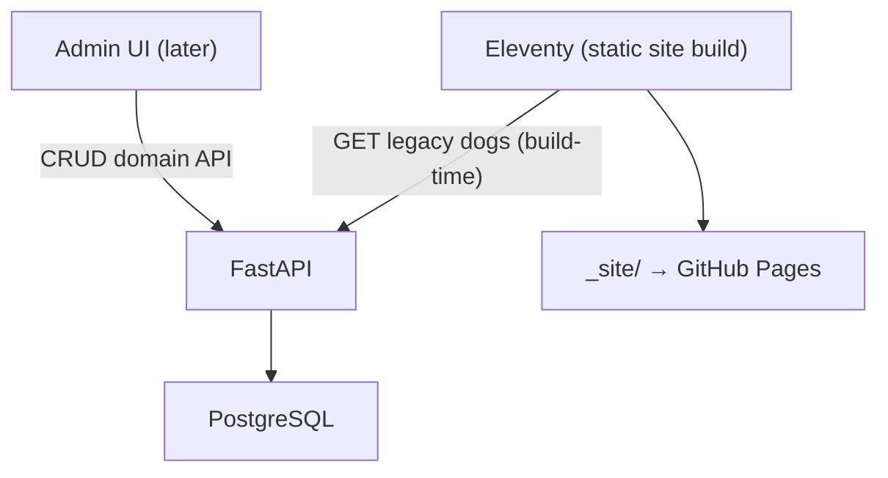
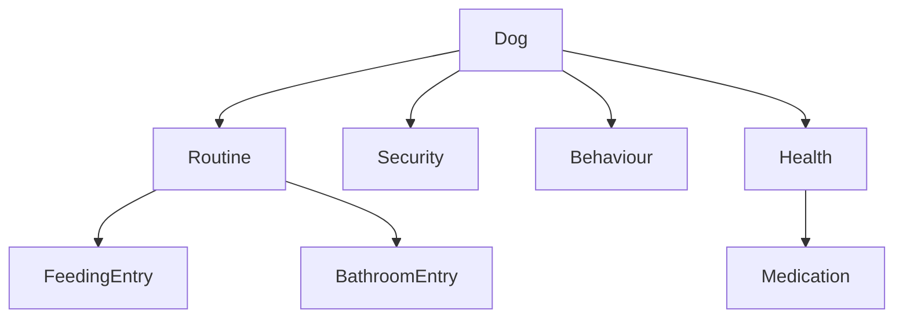

# Backend planning (Petsit) — official spec

This document is the **canonical backend specification** for Petsit: what we are building, why, and the contracts between the static site, backend API, and database.

If other docs or older notes disagree with this document, treat them as **outdated**.

---

## Goals

- Replace `data/*.json` as the source of truth with a **Python backend + PostgreSQL**.
- Keep the public care sheets **static + printable** (Eleventy remains the public renderer).
- Provide a clean path to an **admin UI** later (frontend) for editing dog profiles.
- Use a pragmatic **Domain-Driven Design (DDD)** model so the backend stays understandable and extendable.

## Non-goals (for v1)

- User accounts / multi-tenant permissions.
- Real-time updates on the public site (the public site stays static; updates require a rebuild).
- Perfect parsing of existing free-text feeding/bathroom strings (we will import best-effort and then edit in admin).

---

## System architecture

Public pages stay static; the backend serves JSON and owns Postgres.



### Monorepo layout

Everything lives in one repository:

```
Repo/
├── backend/             # FastAPI app (new)
├── admin/               # optional later: admin UI (new)
├── templates/           # Eleventy templates (existing)
├── styles/              # CSS (existing)
├── data/                # legacy JSON (existing; eventually deprecated)
├── docs/                # documentation (this file)
└── .github/workflows/   # CI (static site; optional API deploy)
```

---

## Domain model (DDD)

Single bounded context: **Dog Care**.

### Aggregate root: `Dog`

`Dog` is the root of the aggregate. Subdomains are owned by the dog profile.



### Subdomains and responsibilities

- **Dog (identity)**: name, slug, breed, gender, size, energy, age/DOB, and core booleans (`vaccinated`, `neutered`, `houseTrained`, `insurance`).
- **Routine**: structured feeding and bathroom schedules + free-text treats + exercise.
- **Security**: identification and tracking (`chipped`, `microchip`, `hasTracker`, `trackerId`).
- **Behaviour**: enjoys/struggles/commands (string lists) and notes fields (text).
- **Health**: conditions/trauma (text), veterinarian URL, and structured medications.

### Derived UI concepts

We do **not** store `alerts` or `warnings` as data fields. They are derived in the frontend (admin UI / preview) from domain data (e.g., `health.conditions`, `behaviour.struggles`, etc.).

---

## Data storage (PostgreSQL)

### Guiding storage rules

- **Structured repeated objects** → child tables (feeding, bathroom, medications).
- **String lists** → `TEXT[]` (enjoys, struggles, commands).
- **Paragraph-like content** → `TEXT` (conditions, trauma, treats, notes).

### Tables overview

**1:1 tables (keyed by `dog_id`)**

- `dogs`
- `routines`
- `security`
- `behaviour`
- `health`

**1:many tables**

- `feeding_entries` (FK `routine_id` → `routines(dog_id)`)
- `bathroom_entries` (FK `routine_id` → `routines(dog_id)`)
- `medications` (FK `dog_id` → `dogs(id)`)

### Key constraints

- **Energy**: integer 0–5.
- **Age**: either `(age_value, age_unit)` both null or both set; optional `date_of_birth`.
- **Security**:
  - if `has_tracker = true` then `tracker_id` required
  - if `chipped = true` then `microchip` required
- **BathroomEntry**: at least one of `pee`/`poo` must be true.

### ScheduleTime (shared type)

Feeding and bathroom entries share a time model:

- `at`: at 08:00
- `between`: between 08:00 and 09:00
- `period`: morning/afternoon/evening/night (bathroom adds `before_bed`)

This is stored as `time_kind` + nullable columns with DB `CHECK` constraints so exactly one shape is used.

---

## API design

### Primary (domain-shaped) API

This is the contract intended for the future admin UI and for backend correctness.

- `GET /api/dogs`
- `GET /api/dogs/{slug}`

Later (write endpoints):

- `PATCH /api/dogs/{slug}` (or per-subdomain endpoints like `PATCH /api/dogs/{slug}/routine`)

### Legacy (flat) API for Eleventy

Eleventy templates currently expect a **flat** object (`dog.feeding` as an array of strings, `dog.chipped` boolean, etc.).

We provide a serializer/endpoint that flattens the domain object into the legacy shape used by the templates.

Chosen approach:

- `GET /api/legacy/dogs`
- `GET /api/legacy/dogs/{slug}`

Legacy formatting examples:

- `routine.feeding[]` structured entries → `"Morning — 120g kibble, raw"`
- `security.chipped` → `dog.chipped`
- `health.conditions` (TEXT) may be exposed as either a string or array depending on what the template expects (templates can render both via `section.njk`).

---

## Migration from legacy JSON

### One-time importer

Script: `backend/scripts/import_json.py`

- Reads `data/*.json`
- Writes `dogs`, `security`, `behaviour`, `health`, `routines`
- Heuristically parses:
  - legacy feeding strings → structured `feeding_entries`
  - legacy bathroom strings → structured `bathroom_entries`
  - legacy medication strings → structured `medications`
- Joins arrays that became text fields:
  - `health` array → `health.conditions` TEXT (newline-separated)
  - `trauma` array → `health.trauma` TEXT (newline-separated)
  - `treats` array → `routines.treats` TEXT (newline-separated)

### Import correctness expectations

Import is **best-effort**. After import, the admin UI (Phase 3) is expected to be used to correct and refine:

- times (“8~9h” vs explicit clock time)
- quantities (“~200g” parsing)
- bathroom pee/poo flags

---

## Local development workflow

Running locally involves three processes:

1. Postgres (Docker)
2. FastAPI (Python)
3. Eleventy dev server (Node)

Environment variables:

- Backend: `DATABASE_URL`
- Eleventy build: `API_URL` (points to backend; local default is `http://localhost:8000`)

---

## Deployment (target)

Split hosting by concern, still one repo:

- **Static site**: GitHub Pages (existing)
- **FastAPI**: Railway or Render (deploy from `backend/`)
- **Postgres**: Neon or Supabase

Static site CI will be configured to set `API_URL` during build so Eleventy can fetch backend data.

---

## Roadmap

- **Phase 1**: DB schema + importer + read-only API (`GET /api/dogs`) + legacy serializer.
- **Phase 2**: Eleventy uses backend at build-time.
- **Phase 3**: Write endpoints + admin UI + auth.
- **Phase 4**: Hosted backend + CI wiring + “publish” workflow.

