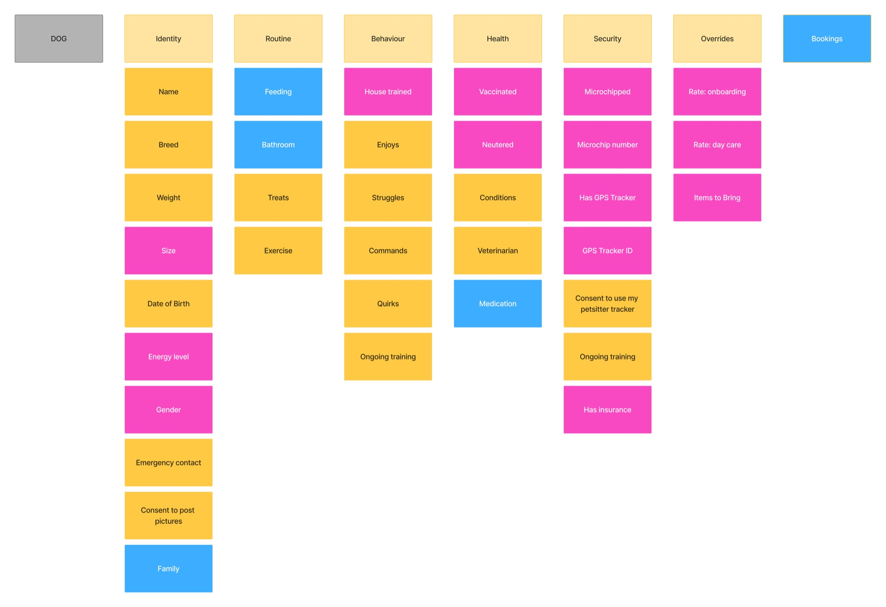
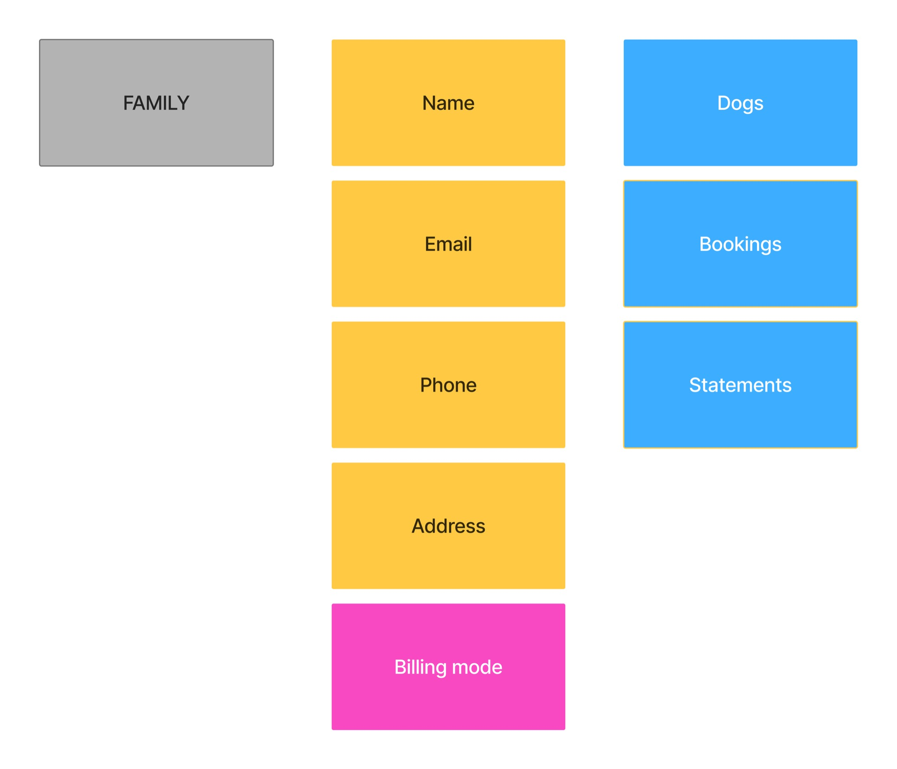
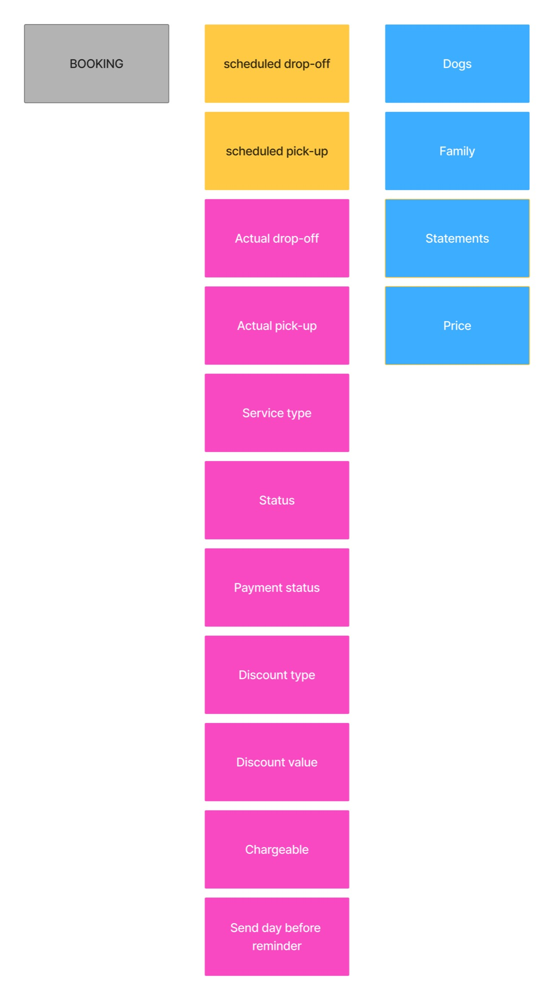
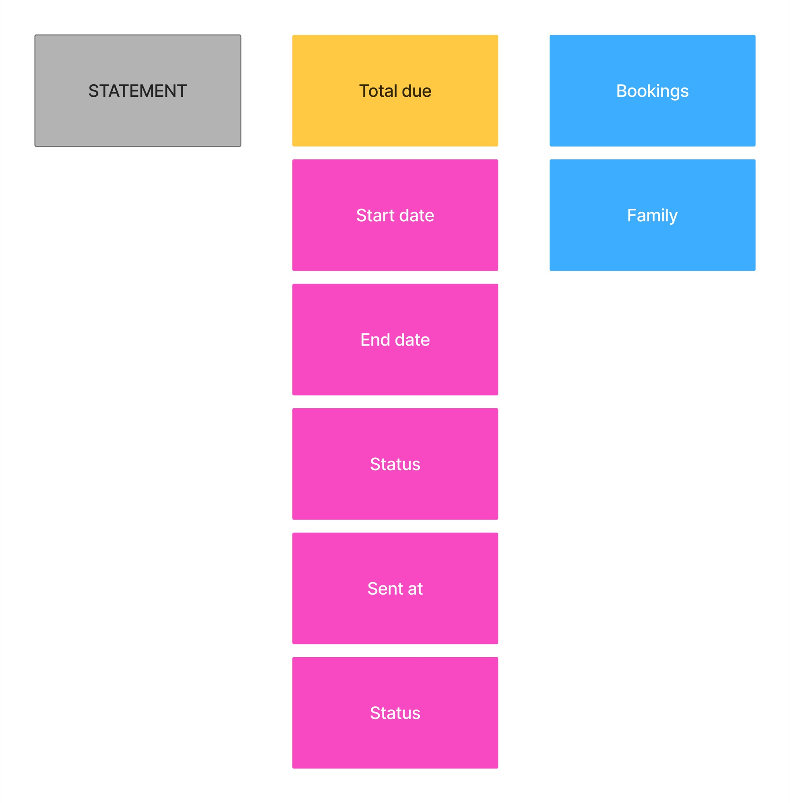

# Concept model

|                  |              |
| ---------------- | ------------ |
| **Owner**        | Ana Tarrisse |
| **Status**       | Approved     |
| **Last updated** | 2026-06-12   |

A **concept model** shows the objects in the product and how they relate. It is not a database schema — it describes what information exists before implementation decisions.

**Scope:**

- dog profiles
- care records
- families
- bookings
- statements
- access (owner accounts and invites)
- workflow objects (calendar sync, emails)

Behaviour rules live in the PRD; this doc is the field-level source of truth.

---

## Overview

_Source: [`dog-profile-overview.mmd`](dog-profile-overview.mmd) — re-export with `npx @mermaid-js/mermaid-cli -i dog-profile-overview.mmd -o dog-profile-overview.svg`_

---

## Entity relationships

Only **true objects** and **repeatable records** appear here. Profile sections are groupings (see overview), not entities in their own right.

_Source: [`ooux-diagram.mmd`](ooux-diagram.mmd)_

| Symbol       | Meaning                                                             |
| ------------ | ------------------------------------------------------------------- |
| `}o--\|\|`   | Many-to-one (each dog has one family; many dogs can share a family) |
| `\|\|--o{`   | One-to-many (dog has many feeding / bathroom / medication entries)  |
| `}o--o{`     | Many-to-many (booking can include multiple dogs)                    |
| `\|\|--o\|`  | Zero or one (optional emergency contact per dog)                    |
| `\|\|--\|\|` | One-to-one (one owner account per family)                           |

---

## Profile section groupings

These are **not separate objects**. They are how care information is organized on a dog's profile (matches [§1.1](03-PRODUCT-REQUIREMENTS.md#11-dog-profiles)).

Field tables use **Field · Type · Notes**. Notes give allowed values, constraints, or free-text intent where it matters for build.

### Identity

| Field         | Type    | Notes                                    |
| ------------- | ------- | ---------------------------------------- |
| name          | string  | Required                                 |
| breed         | string  | Free text                                |
| gender        | string  | Fixed enum — see [Gender](#gender) below |
| size          | string  | Fixed enum — see [Size](#size) below     |
| date_of_birth | date    | Optional; used with age display          |
| energy        | int     | 0–5 — see [Energy](#energy) below        |
| vaccinated    | boolean |                                          |
| neutered      | boolean |                                          |
| house_trained | boolean |                                          |
| insurance     | boolean |                                          |

**Gender**

Fixed enum — one of `Male` or `Female`.

**Size**

Fixed enum — one of `Toy`, `Small`, `Medium`, `Large`, or `Giant`. When the dog's weight is known, set size from the matching band:

| Value    | Weight      |
| -------- | ----------- |
| `Toy`    | Under 5 kg  |
| `Small`  | 5 to 10 kg  |
| `Medium` | 10 to 25 kg |
| `Large`  | 25 to 45 kg |
| `Giant`  | 45+ kg      |

**Energy**

Scale 0–5 (low → high). Used on the profile to set care expectations; free-text fields in Routine and Behaviour carry detail.

| Value | Meaning (guide)                    |
| ----- | ---------------------------------- |
| 0     | Very low — mostly calm             |
| 1     | Low                                |
| 2     | Moderate-low                       |
| 3     | Moderate                           |
| 4     | High                               |
| 5     | Very high — needs lots of activity |

### Routine

| Field    | Type       | Notes                                                   |
| -------- | ---------- | ------------------------------------------------------- |
| treats   | text       | Free text                                               |
| exercise | text       | Free text                                               |
| feeding  | Feeding[]  | see [feeding entry](#feeding-entry-repeatable-record)   |
| bathroom | Bathroom[] | see [bathroom entry](#bathroom-entry-repeatable-record) |

**Feeding entry**

| Field         | Type   | Notes                                               |
| ------------- | ------ | --------------------------------------------------- |
| time_kind     | string | Free text label (e.g. `"Morning"`, `"Evening"`)     |
| at_time       | time   | Optional; fixed time when `time_kind` is a set time |
| between_start | time   | Optional; window start                              |
| between_end   | time   | Optional; window end                                |
| period        | string | Free text (e.g. `"daily"`, meal context)            |

**Bathroom entry**

| Field     | Type    | Notes                                      |
| --------- | ------- | ------------------------------------------ |
| time_kind | string  | Free text label (e.g. `"After breakfast"`) |
| pee       | boolean | Expect pee at this time                    |
| poo       | boolean | Expect poo at this time                    |

### Behaviour

| Field     | Type | Notes     |
| --------- | ---- | --------- |
| enjoys    | text | Free text |
| struggles | text | Free text |
| commands  | text | Free text |
| notes     | text | Free text |

### Health

| Field        | Type         | Notes                                           |
| ------------ | ------------ | ----------------------------------------------- |
| conditions   | text         | Free text                                       |
| trauma       | text         | Free text                                       |
| veterinarian | text         | Free text (name, clinic, or contact)            |
| medication   | Medication[] | see [medication](#medication-repeatable-record) |

**Medication**

| Field    | Type   | Notes                      |
| -------- | ------ | -------------------------- |
| name     | string | Required when entry exists |
| dosage   | string | Free text                  |
| schedule | string | Free text                  |

### Security

| Field           | Type    | Notes                                                                   |
| --------------- | ------- | ----------------------------------------------------------------------- |
| microchipped    | boolean |                                                                         |
| microchip       | string  | Optional; chip number when `microchipped` is true                       |
| has_tracker     | boolean | Dog's own GPS tracker                                                   |
| tracker_id      | string  | Optional; dog's own tracker ID when `has_tracker` is true               |
| tracker_consent | boolean | Owner agrees petsitter may use **her** tracker on this dog during stays |

### Items to bring (per-dog override)

Optional per service type. Used in [day-before reminder](03-PRODUCT-REQUIREMENTS.md#434-day-before-reminder) emails when set; otherwise falls back to petsitter baseline. **Petsitter-only** — not on owner intake form.

| Field                   | Type | Notes                                        |
| ----------------------- | ---- | -------------------------------------------- |
| items_to_bring_day_care | text | Replaces baseline day care list for this dog |
| items_to_bring_boarding | text | Replaces baseline boarding list for this dog |

### Rates (per-dog override)

Optional. Replaces petsitter global default for this dog when set. See [§6.2](03-PRODUCT-REQUIREMENTS.md#62-rates). **Petsitter-only** — not on owner intake form.

| Field         | Type    | Notes                                      |
| ------------- | ------- | ------------------------------------------ |
| rate_day_care | decimal | Optional override for day care             |
| rate_boarding | decimal | Optional override for boarding (per night) |

### Emergency contact (related object)

`emergency_contact` on each dog. The [family profile](03-PRODUCT-REQUIREMENTS.md#12-families) offers a **shortcut** to pre-fill new dogs and bulk-update existing dogs.

| Field | Type   | Notes                        |
| ----- | ------ | ---------------------------- |
| name  | string | Required when contact is set |
| phone | string | Required when contact is set |

---

## Related objects

### Family

| Field                      | Type   | Notes                                                                                                                                                                 |
| -------------------------- | ------ | --------------------------------------------------------------------------------------------------------------------------------------------------------------------- |
| name                       | string | Household or client name                                                                                                                                              |
| email                      | string | Primary contact; portal invites and statement delivery                                                                                                                |
| phone                      | string | Contact number                                                                                                                                                        |
| address                    | string | Home address                                                                                                                                                          |
| billing_mode               | string | `Monthly` or `Per booking`; default `Per booking`. See [§6.1](03-PRODUCT-REQUIREMENTS.md#61-billing-mode).                                                            |
| emergency_contact_shortcut | UI     | **Not stored on family** — editing emergency contact on the family profile writes to every dog's `emergency_contact` ([§1.2](03-PRODUCT-REQUIREMENTS.md#12-families)) |

### Owner account (related object)

One read-only portal account per family. Invite-only — see [§2.1](03-PRODUCT-REQUIREMENTS.md#21-registration).

| Field  | Type   | Notes                                                                                                                          |
| ------ | ------ | ------------------------------------------------------------------------------------------------------------------------------ |
| family | Family | One account per family                                                                                                         |
| status | string | `active` or `revoked` — petsitter may revoke; revoke unlinks portal access ([§2.3](03-PRODUCT-REQUIREMENTS.md#23-invite-flow)) |

### Portal invite (related object)

Invitation for an owner to create their account. See [§2.3](03-PRODUCT-REQUIREMENTS.md#23-invite-flow).

| Field      | Type     | Notes                                               |
| ---------- | -------- | --------------------------------------------------- |
| family     | Family   | Scoped to one household                             |
| token      | string   | Unique link token                                   |
| expires_at | datetime | 30 days from creation                               |
| used_at    | datetime | Optional; set when owner completes registration     |
| delivery   | string   | `email` or `link` — how petsitter shared the invite |

### Intake link (related object)

One-time link for an owner to submit a new dog profile. See [§1.4](03-PRODUCT-REQUIREMENTS.md#14-dog-intake-form).

| Field      | Type     | Notes                                          |
| ---------- | -------- | ---------------------------------------------- |
| family     | Family   | Dog is created under this family on submission |
| token      | string   | Unique link token                              |
| expires_at | datetime | 30 days from creation                          |
| used_at    | datetime | Optional; set on submission — link invalidated |

### Booking (related object)

| Field                    | Type        | Notes                                                                                                                                                              |
| ------------------------ | ----------- | ------------------------------------------------------------------------------------------------------------------------------------------------------------------ |
| dogs                     | Dog[]       | One or more dogs from the **same family** — see [§3.2](03-PRODUCT-REQUIREMENTS.md#32-booking-inputs)                                                               |
| drop_off                 | datetime    | Scheduled; owner leaves the dog — see [§3.2](03-PRODUCT-REQUIREMENTS.md#32-booking-inputs)                                                                         |
| pick_up                  | datetime    | Scheduled; owner collects the dog                                                                                                                                  |
| actual_drop_off          | datetime    | Optional; recorded when petsitter taps **Start booking** ([§3.4](03-PRODUCT-REQUIREMENTS.md#34-booking-lifecycle)). Operational only — not used for pricing        |
| actual_pick_up           | datetime    | Optional; recorded when petsitter taps **End booking** ([§3.4](03-PRODUCT-REQUIREMENTS.md#34-booking-lifecycle)). Operational only — not used for pricing          |
| service_type             | string      | `Day care` or `Boarding` — auto-detected from dates ([§3.3](03-PRODUCT-REQUIREMENTS.md#33-service-type))                                                           |
| status                   | string      | `Upcoming`, `Ongoing`, `Completed`, or `Cancelled` — see [§3.4](03-PRODUCT-REQUIREMENTS.md#34-booking-lifecycle)                                                   |
| discount_type            | string      | `percentage` or `fixed` — optional                                                                                                                                 |
| discount_value           | decimal     | Optional                                                                                                                                                           |
| send_day_before_reminder | boolean     | Default `false`; petsitter opts in per booking — see [§3.2](03-PRODUCT-REQUIREMENTS.md#32-booking-inputs)                                                          |
| chargeable               | boolean     | When `Cancelled`, default `true`; petsitter may set `false` if not chargeable ([§3.5](03-PRODUCT-REQUIREMENTS.md#35-edit-and-cancel)). Only applies when cancelled |
| payment_status           | string      | `unpaid` or `paid` — see [§6.5](03-PRODUCT-REQUIREMENTS.md#65-payment)                                                                                             |
| statements               | Statement[] | Bookings may appear on multiple sent statements while unpaid — see [§6.3.1](03-PRODUCT-REQUIREMENTS.md#631-statement-form--two-input-modes)                        |

**Price (display only)**

Not a stored field. The amount shown on dog profile and statements ([§3.6](03-PRODUCT-REQUIREMENTS.md#36-bookings-on-dog-profile), [§6.2](03-PRODUCT-REQUIREMENTS.md#62-rates)) is **calculated** when displayed: per-dog rate × service units for each dog on the booking, summed, minus booking discount. Petsitter sets rates and discount — never enters a total price directly.

### Statement (related object)

Groups unpaid eligible bookings and includes them in one statement email to a family. Not a formal invoice — a send record with a total snapshot.

| Field      | Type      | Notes                                                                                                                                                                                                     |
| ---------- | --------- | --------------------------------------------------------------------------------------------------------------------------------------------------------------------------------------------------------- |
| family     | Family    |                                                                                                                                                                                                           |
| status     | string    | `draft` (M4 month-end, until **Approve**) or `sent`                                                                                                                                                       |
| start_date | date      | **Start date** — while composing, from date range or bulk select; **on send**, updates to earliest included scheduled drop-off ([§6.3.1](03-PRODUCT-REQUIREMENTS.md#631-statement-form--two-input-modes)) |
| end_date   | date      | **End date** — while composing, from date range or bulk select; **on send**, updates to latest included scheduled pick-up                                                                                 |
| total_due  | decimal   | Snapshot at send time                                                                                                                                                                                     |
| sent_at    | datetime  | When the statement email was sent                                                                                                                                                                         |
| bookings   | Booking[] | Unpaid eligible bookings included                                                                                                                                                                         |

Statement period (portal and email) = **Start date** through **End date** on the sent record.

### Calendar event (related object)

External Google Calendar event synced from a booking _(M4)_. See [§4.2](03-PRODUCT-REQUIREMENTS.md#42-petsitter-calendar-sync).

| Field       | Type    | Notes                                              |
| ----------- | ------- | -------------------------------------------------- |
| booking     | Booking | One event per booking                              |
| external_id | string  | Google Calendar event ID                           |
| sync_status | string  | `synced`, `pending`, or `failed` — for retry logic |

### Email (related object)

A sent email record. Access emails ([§2.3](03-PRODUCT-REQUIREMENTS.md#23-invite-flow)); booking and statement emails ([§4.3](03-PRODUCT-REQUIREMENTS.md#43-owner-emails)).

| Field     | Type      | Notes                                                |
| --------- | --------- | ---------------------------------------------------- |
| type      | string    | See [email types](#email-types) below                |
| family    | Family    | Recipient household (family email on file)           |
| booking   | Booking   | Optional; when the email is about a specific booking |
| statement | Statement | Optional; when the email is a statement              |
| sent_at   | datetime  | When sent (or last retry attempt)                    |

**Email types**

| Type                   | Trigger                                         | Milestone |
| ---------------------- | ----------------------------------------------- | --------- |
| `portal_invite`        | Petsitter sends owner account invite            | M1        |
| `intake_invite`        | Petsitter sends dog intake link                 | M1        |
| `dog_created`          | Owner submits intake form                       | M1        |
| `booking_confirmation` | Booking created                                 | M4        |
| `booking_update`       | Booking dates or times changed                  | M4        |
| `booking_cancellation` | Booking cancelled                               | M4        |
| `day_before_reminder`  | Morning before drop-off when enabled on booking | M4        |
| `statement`            | Petsitter sends or approves a statement         | M3 / M4   |

---

## Petsitter settings

Configured once in app settings. Not part of the dog profile.

| Field                     | Type    | Notes                                                                          |
| ------------------------- | ------- | ------------------------------------------------------------------------------ |
| rate_day_care             | decimal | Global default day care rate — see [§6.2](03-PRODUCT-REQUIREMENTS.md#62-rates) |
| rate_boarding             | decimal | Global default boarding rate (per night)                                       |
| items_to_bring_day_care   | text    | Default list for day care reminders                                            |
| items_to_bring_boarding   | text    | Default list for boarding reminders                                            |
| google_calendar_connected | boolean | Whether petsitter has connected Google Calendar _(M4)_                         |

---

## PRD section map

| PRD section       | In this model                                                                                                    |
| ----------------- | ---------------------------------------------------------------------------------------------------------------- |
| §1.1 Identity     | Fields on `Dog` + [Gender](#gender), [Size](#size), [Energy](#energy)                                            |
| §1.1 Routine      | Section grouping — fields + feeding/bathroom entries                                                             |
| §1.1 Behaviour    | Section grouping — fields on profile                                                                             |
| §1.1 Health       | Section grouping — fields + medication entries + emergency contact                                               |
| §1.1 Security     | Section grouping — fields on profile                                                                             |
| §1.2 Families     | [Family](#family) + emergency contact shortcut                                                                   |
| §1.4 Intake form  | [Intake link](#intake-link-related-object)                                                                       |
| §2 Access         | [Owner account](#owner-account-related-object), [Portal invite](#portal-invite-related-object)                   |
| §3 Bookings       | [Booking](#booking-related-object)                                                                               |
| §4 Calendar/email | [Calendar event](#calendar-event-related-object), [Email](#email-related-object)                                 |
| §6 Statements     | [Statement](#statement-related-object); rates in [petsitter settings](#petsitter-settings) and per-dog overrides |

---

## Changelog

### 2026-06-12

- **Scope expanded** — from dog profile only to full product: families, bookings, statements, access (owner account, portal invite, intake link), and M4 workflow objects (calendar event, email)
- **Status** — Needs review → **Approved**
- **Field tables** — **Field · Type · Notes** format; fixed enums documented for Identity (gender, size, energy)
- **Diagrams** — per-object JPG maps (Dog, Family, Booking, Statement); overview SVG and ER diagram updated
- **PRD section map** — table linking each PRD section to objects in this model
- **Statement object** — `start_date` and `end_date` fields; notes document composing vs on-send values
